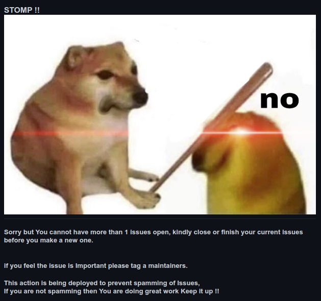

<p align="center">

</p> <br>

# Rouge Spammers with a mission to disrupt the peace of the valley ? Fear not we will STOMP the Spammers
This tool was created to helps you to protect your project  from being spammed. 
<br> You can customise the ``` maxIssue```  to set the maximum count of active issue a contributor can have. <br>
The project is currently a work in progress might have bugs if you do find bugs please report it [here](https://github.com/anushkrishnav/Issue-Watcher/issues) <br>



### Example workflow

```yaml
name: check
 
on:
  issues:
    types: [opened]

jobs:
  first-job:
    runs-on: ubuntu-latest
    steps:
    - name: Checkout code
        uses: actions/checkout@main
    - name: Run Action
        uses: anushkrishnav/Issue-Watcher@main
        uses: ./
        with:
          token: ${{ secrets.GITHUB_TOKEN }} # default token in GitHub Workflow
          author: anushkrishnav
          repo: {owner}/{repo} # your repo
          maxIssue: 2

```
# Note
This project is a WIP.
If you find a security threat or bug please feel free to open up an issue and i will get to it shortly
# Thank you 
### [PyGithub](https://github.com/PyGithub/PyGithub) - Awesome package that made this action possible <br>
### [actions/container-action](https://github.com/actions/container-action) - Container Action Template
### [jacobtomlinson/python-container-actionTemplate](https://github.com/jacobtomlinson/python-container-action) -  amazing starter template

# License
MIT licensed. See the bundled [LICENSE](LICENSE) file for more details.
