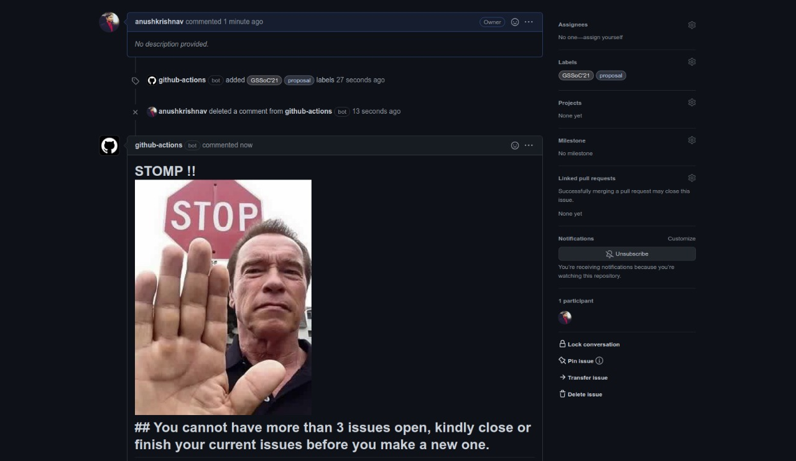

# Rouge Spammers with a mission to disrupt the peace of the valley ? Fear not we will STOMP the Spammers



### Example workflow

```yaml
name: check
 
on:
  issues:
    types: [opened]

jobs:
  first-job:
    runs-on: ubuntu-latest
    steps:
      - name: Checkout code
        uses: anushkrishnav/Issue-Police@main
      - name: Run Action
        uses: ./
        with:
          token: ${{ secrets.GITHUB_TOKEN }} # default token in GitHub Workflow
          author: anushkrishnav
          repo: {owner}/{repo}

```
# Note
This project is a WIP.
If you find a security threat or bug please feel free to open up an issue and i will get to it shortly
# Thank you 
### [PyGithub](https://github.com/PyGithub/PyGithub) - Awesome package that made this action possible <br>
### [actions/container-action](https://github.com/actions/container-action) - Container Action Template
### [jacobtomlinson/python-container-actionTemplate](https://github.com/jacobtomlinson/python-container-action) -  amazing starter template

# License
MIT licensed. See the bundled [LICENSE](LICENSE) file for more details.
